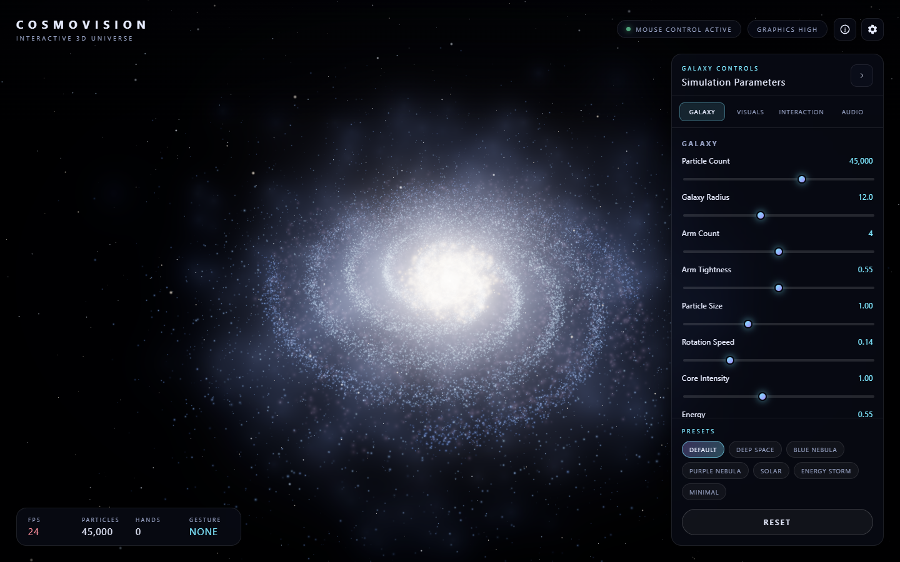
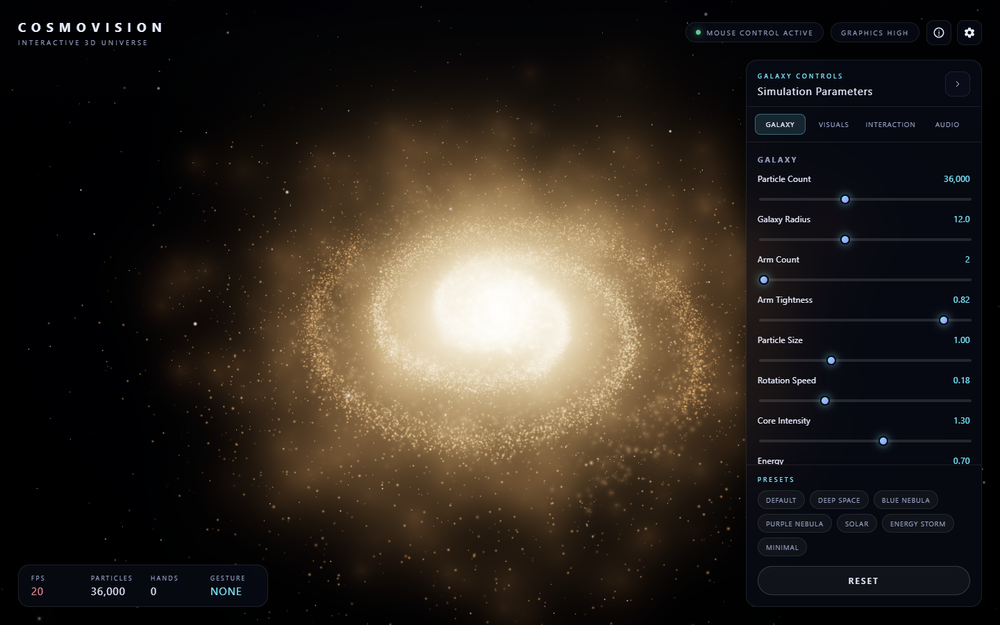
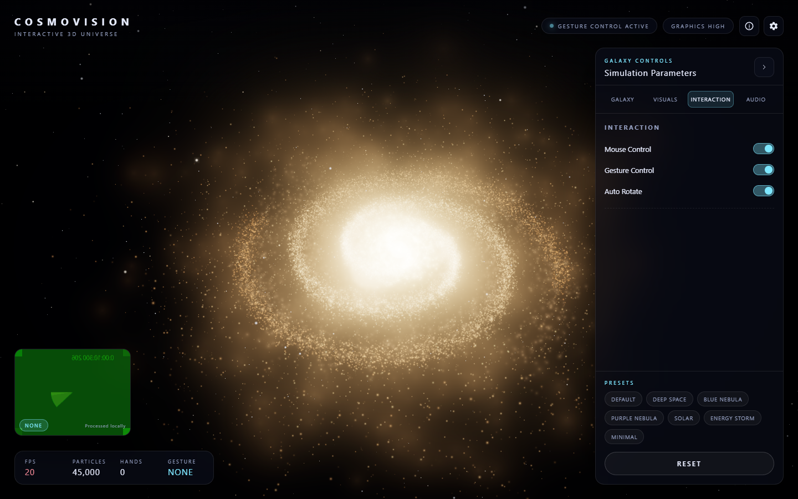
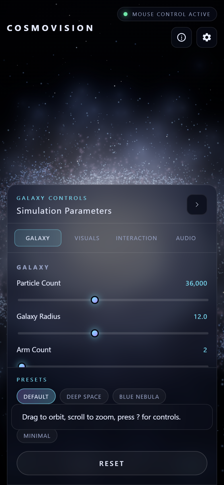
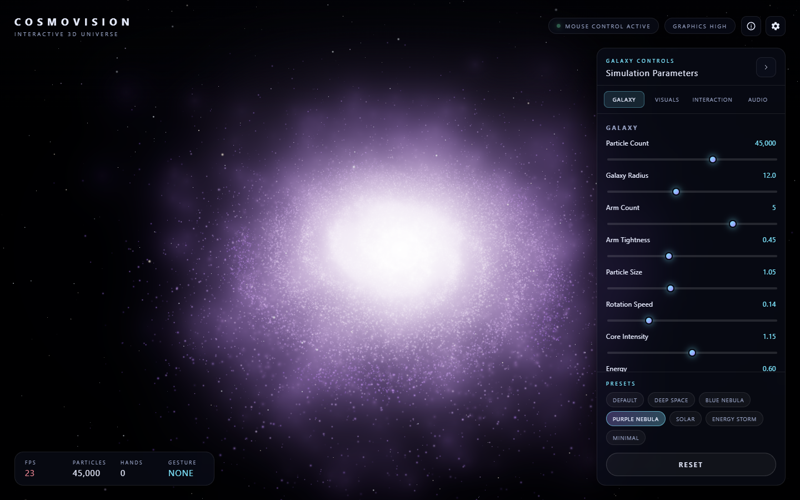
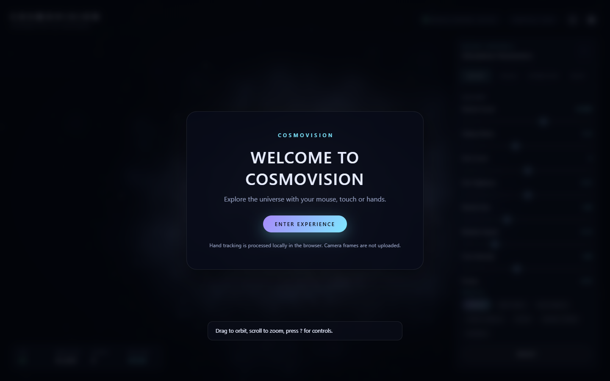

<div align="center">

# CosmoVision — Interactive 3D Universe

**A cinematic, procedural galaxy you can steer with your mouse, touch and hands.**

**[Live demo →](https://cosmovision-tau.vercel.app)** · **[Release v1.0.0](https://github.com/deepsh3969/CosmoVision/releases/tag/v1.0.0)**


</div>

---

## Overview

CosmoVision is a frontend-only WebGL experience that renders a 45,000+ particle spiral galaxy in real time and layers professional-grade interactivity on top of it: damped orbit controls, MediaPipe hand tracking, procedural ambient audio that drives the visuals, seven art-directed presets, and a glassmorphism HUD that stays out of the way.

Everything runs in the browser. There is no backend, no API key, and no camera footage ever leaves the device.

## Screenshots

| Desktop | Controls |
| --- | --- |
|  |  |

| Hand tracking | Mobile |
| --- | --- |
|  |  |

| Purple Nebula preset | Welcome |
| --- | --- |
|  |  |

## Features

**Galaxy**
- Procedural spiral generated from deterministic math (seeded RNG, Gaussian scatter, radial falloff, vertical thickness)
- 20,000–60,000 particles across four layers: spiral arms, core bulge, dust lanes, floating cosmic motes
- Differential rotation implemented in the vertex shader (inner disc turns faster than the rim)
- Separate nebula cloud layer and a 5,000+ star deep-field background with twinkle
- Live parameter sliders: particle count, radius, arm count, arm tightness, particle size, rotation speed, core intensity, energy

**Core object**
- Inner glow sphere, fresnel outer shell, two counter-rotating energy rings, 1,400-particle halo, additive sprite glow
- Pulses with energy, audio bass and camera proximity; tilts toward the pointer

**Camera**
- Mouse drag orbit, wheel zoom, right-drag pan, touch drag, two-finger pinch zoom
- Keyboard: `W/S` zoom, `A/D` rotate, `Q/E` vertical, `R` reset, `SPACE` pause
- Exponential damping on every axis plus polar/distance/target clamps so the camera never escapes the scene

**Hand gestures (MediaPipe Hands, local)**
- Two hands, 21 landmarks each, 30+ FPS throttled detection
- Open palm → energy up, fist → energy down, index point → precision rotation, pinch → zoom
- Hand position → galaxy rotation / vertical tilt
- Two-hand spread → expand & compress the galaxy, two-hand pinch → advanced zoom
- Overlay renders landmarks, connections, fingertips, bounding box and the live gesture name
- Every raw value passes through damping before it reaches the scene

**Audio**
- Procedural Web Audio ambient drone (never autoplays — starts on your click)
- FFT analysis splits bass / mids / highs: bass drives scale, mids drive brightness, highs drive twinkle
- Volume slider and reactivity toggle

**Interface**
- Collapsible control panel with Galaxy / Visuals / Interaction / Audio tabs
- Seven presets: Default, Deep Space, Blue Nebula, Purple Nebula, Solar, Energy Storm, Minimal + Reset
- Settings: graphics quality (Auto/Low/Medium/High/Ultra), particle budget, post-processing, gesture tracking, audio, reduced motion
- Cinematic loading sequence, first-visit welcome, help modal, toast notifications
- HUD telemetry: FPS, particle count, hands tracked, active gesture
- Keyboard accessible, ARIA-labelled, honours `prefers-reduced-motion`

**Performance & resilience**
- Single `BufferGeometry` per layer with typed arrays, one draw call per layer, `devicePixelRatio` capped per quality tier
- Adaptive degradation: sustained low FPS steps down resolution, particle scale and bloom automatically
- Preferences and panel state persist in `localStorage`
- Friendly recovery paths for missing WebGL, denied camera, failed MediaPipe load and unsupported audio — the galaxy always keeps running in mouse mode

## Technologies

| Layer | Choice |
| --- | --- |
| Markup / style / logic | HTML5, CSS3, vanilla ES modules |
| Rendering | Three.js 0.166 (WebGL2), custom GLSL `ShaderMaterial`, `UnrealBloomPass` post-processing |
| Hand tracking | `@mediapipe/tasks-vision` HandLandmarker (GPU delegate, CPU fallback) |
| Audio | Web Audio API — procedural synthesis + `AnalyserNode` |
| Tooling | `serve` for local development, static deployment on Vercel |

## Architecture

```text
CosmoVision/
├── index.html          entry, import map, SEO/OG metadata, HUD markup
├── style.css           design system, glassmorphism HUD, responsive layout
├── script.js           Experience orchestrator: boot stages, render loop, wiring
├── js/
│   ├── config.js       defaults, presets, colour themes, quality tiers, UI schema
│   ├── utils.js        seeded RNG, damping, easing, glow texture, storage helpers
│   ├── galaxy.js       procedural particle generation + point shaders
│   ├── starfield.js    deep-field background stars
│   ├── core.js         central core: spheres, rings, halo, sprite glow
│   ├── controls.js     damped orbit/zoom/pan controller (mouse, touch, keyboard)
│   ├── gestures.js     MediaPipe engine, gesture grammar, overlay renderer
│   ├── audio.js        procedural ambient synth + frequency band analysis
│   ├── postfx.js       EffectComposer / bloom / output pass wrapper
│   ├── performance.js  FPS monitor, quality profiles, adaptive degradation
│   └── ui.js           HUD, panels, modals, toasts, persistence
├── assets/             favicon, audio, textures
├── screenshots/        store-ready captures
├── package.json        `npm run dev`
└── .gitignore
```

Each subsystem owns its state and exposes a small `update(...)`/`dispose(...)` surface; the orchestrator only sequences them.

## Controls

**Mouse / touch** — drag to orbit, scroll or pinch to zoom, right-drag to pan.

**Keyboard**

| Key | Action |
| --- | --- |
| `W` / `S` | Zoom in / out |
| `A` / `D` | Rotate left / right |
| `Q` / `E` | Move view up / down |
| `R` | Reset camera |
| `SPACE` | Pause / resume |
| `?` | Open help |

**Gesture**

| Gesture | Effect |
| --- | --- |
| Open palm | Increase galaxy energy |
| Fist | Decrease galaxy energy |
| Index point | Steer galaxy rotation |
| Pinch | Zoom camera |
| Move hand | Rotate / tilt galaxy |
| Two hands apart | Expand galaxy |
| Two hands together | Compress galaxy |

## Installation

```bash
git clone https://github.com/deepsh3969/CosmoVision.git
cd CosmoVision
npm install
```

## Local development

```bash
npm run dev
```

Serves the project at `http://localhost:4173`. A static server is required — ES modules do not load over `file://`.

## Deployment

The project is fully static. Deploy the repository root to Vercel (framework preset: **Other**), or from the CLI:

```bash
npm i -g vercel
vercel --prod
```

No environment variables, build step or database is required. Camera access requires HTTPS, which Vercel provides by default.

## Browser requirements

- Chrome / Edge 111+, Firefox 115+, Safari 16.4+ (WebGL2 required)
- Camera + `getUserMedia` for hand tracking (optional — everything else works without it)
- Web Audio API for the ambient soundtrack (optional)

## Privacy

Hand tracking runs entirely in your browser through MediaPipe. **Camera frames are never uploaded, recorded or transmitted.** CosmoVision has no backend: no analytics, no accounts, no cookies. Only your UI preferences are stored, in your own `localStorage`.

## Performance

- 60 FPS target on discrete GPUs at 45K particles with bloom
- Three to four draw calls for the entire scene; no per-particle meshes or DOM nodes
- Quality tiers scale pixel ratio (1.0–2.0), particle budget and bloom
- Mobile and low-memory devices start on reduced particles and auto-tune down if FPS sags
- MediaPipe detection is throttled to ~30 FPS and pauses when the tab is hidden

## Roadmap

- Color-graded LUT presets per theme
- Exportable screenshot / time-lapse mode
- WebXR viewing mode
- Optional comet and satellite passes
- MIDI / beat-sync audio input

## Author

**Deepesh Chaurasia** — [@deepsh3969](https://github.com/deepsh3969)

Built as a creative-WebGL portfolio piece: procedural generation, shader-driven motion, computer-vision interaction and production UI in one static bundle.

## License

MIT
