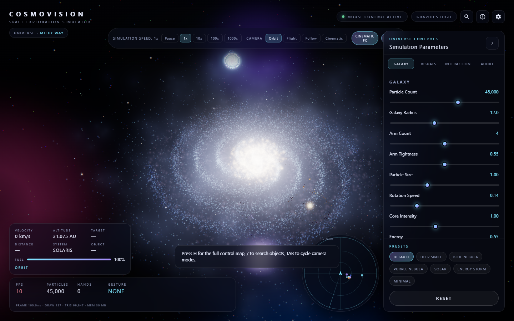
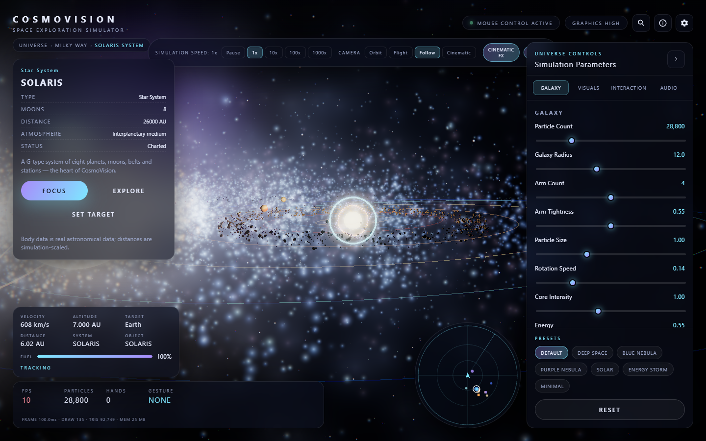
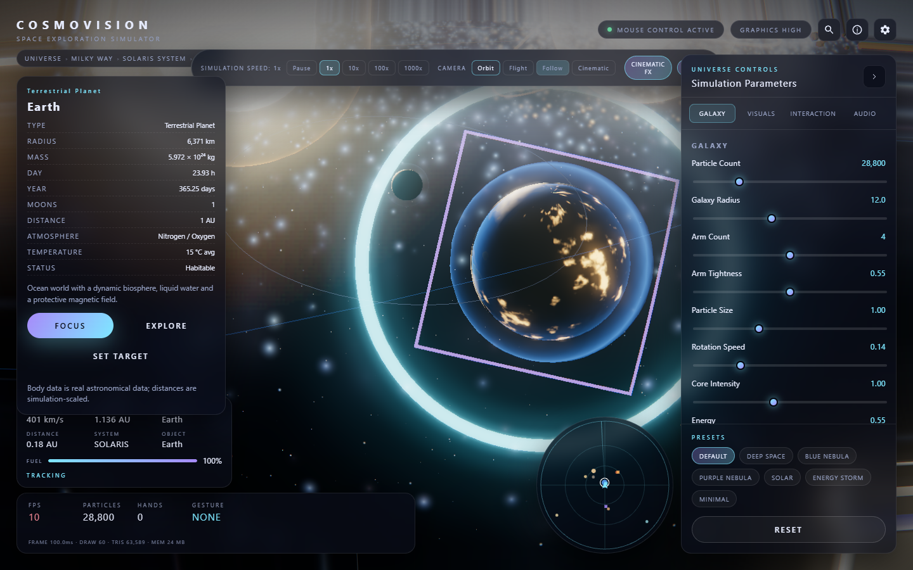
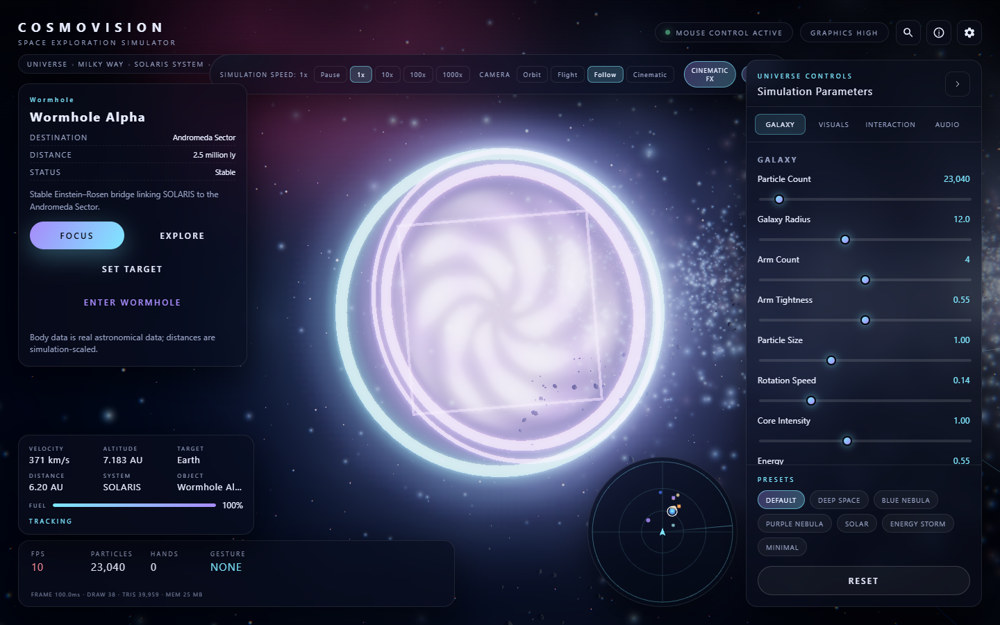
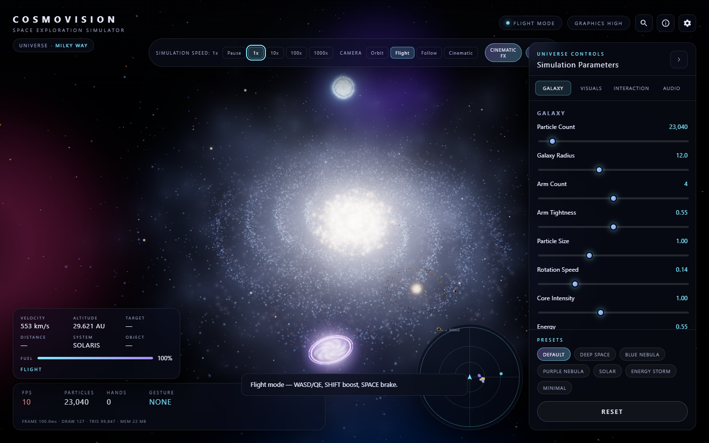
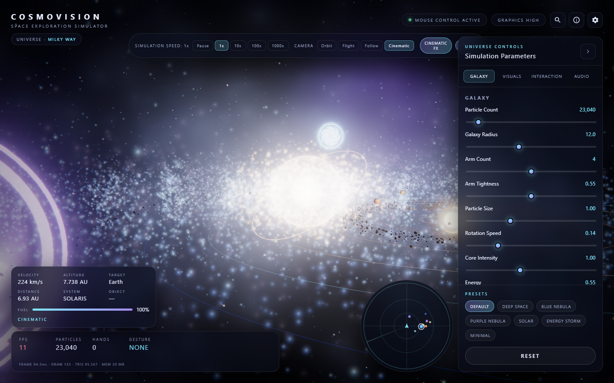
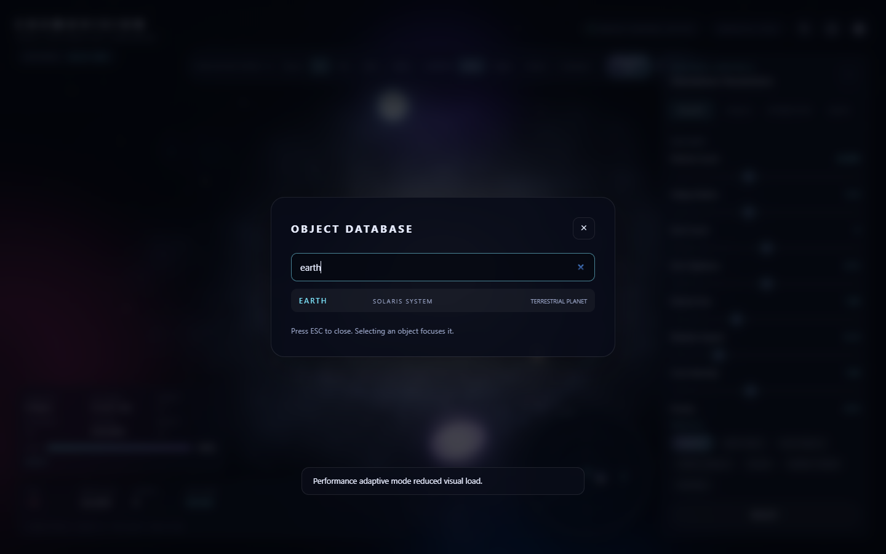
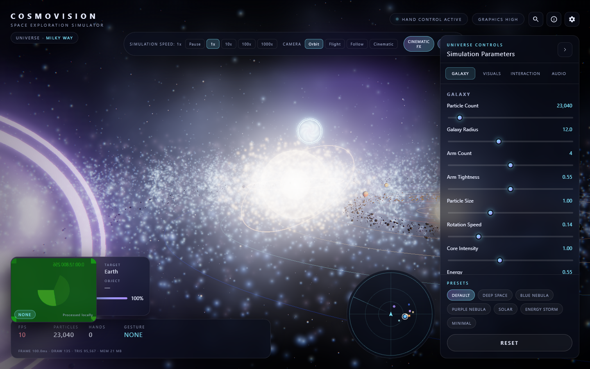
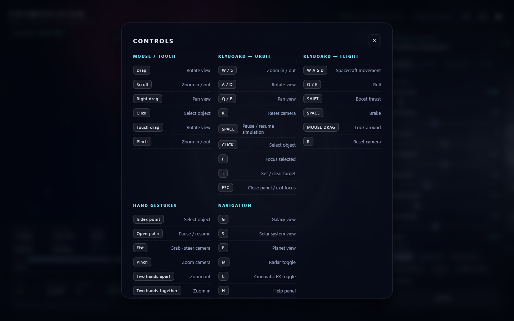
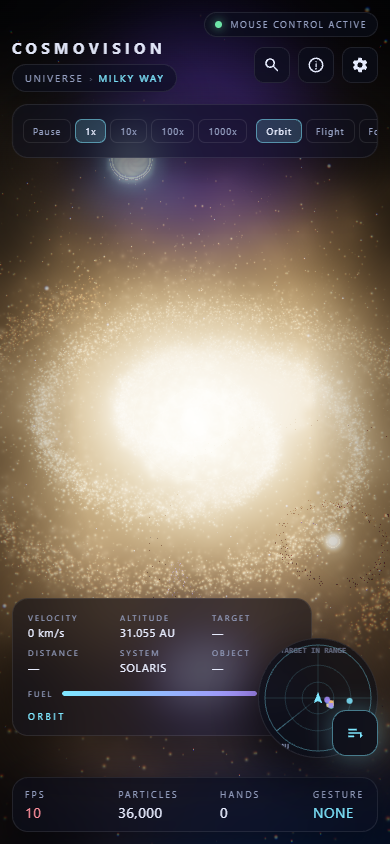

<div align="center">

# CosmoVision — Space Exploration Simulator

**Pilot a spacecraft through a procedural galaxy: explore the SOLARIS system, planets, moons, stations and wormholes with mouse, touch or hand gestures.**

**[Live demo →](https://cosmovision-tau.vercel.app)** · **[Release v2.0.0](https://github.com/deepsh3969/CosmoVision/releases/tag/v2.0.0)** · **[v1.0.0](https://github.com/deepsh3969/CosmoVision/releases/tag/v1.0.0)**


</div>

---

## Overview

CosmoVision v2.0 turns the original cinematic galaxy into a full **space exploration simulator**. The universe now contains a procedural Milky Way, the SOLARIS star system with eight planets and their moons, asteroid belts, orbital stations, four wormholes and a flyable spacecraft — all rendered in real time in your browser with a professional sci-fi HUD on top.

Everything runs client-side. There is no backend, no API key, and no camera footage ever leaves the device.

## Screenshots

| Universe | SOLARIS system |
| --- | --- |
|  |  |

| Earth — focus & selection | Wormhole transit |
| --- | --- |
|  |  |

| Spacecraft flight | Cinematic mode |
| --- | --- |
|  |  |

| Search database | Hand gestures |
| --- | --- |
|  |  |

| Help & controls | Mobile |
| --- | --- |
|  |  |

## Features

**Procedural universe**
- Milky Way built from deterministic math: seeded RNG, Gaussian scatter, radial falloff, differential rotation in the vertex shader, dust lanes, nebula clouds and a deep-field star background
- SOLARIS system on a 1-unit = 1 AU scale: star, 8 planets, 4 moons, 2 asteroid belts, orbit lines and 48 orbital stations
- Four wormholes with animated swirl discs, counter-rotating rings and transit destinations
- Live parameter sliders (particle count, radius, arms, tightness, rotation, core intensity, energy) and seven presets: Default, Deep Space, Blue Nebula, Purple Nebula, Solar, Energy Storm, Minimal

**Spacecraft**
- Dedicated flight mode: `WASD` pitch/yaw, `Q/E` roll, `SHIFT` boost, `SPACE` brake, `R` reset
- Fuel gauge, velocity / altitude telemetry and wormhole proximity warnings

**HUD & navigation**
- Breadcrumb trail: UNIVERSE → MILKY WAY → SOLARIS SYSTEM → object
- Simulation speed control: Pause, 1x, 10x, 100x, 1000x
- Camera modes: Orbit, Flight, Follow (focus), Cinematic — switchable from the top bar or `TAB`
- Object info panel with Focus / Explore / Set Target / Enter Wormhole actions
- Database search (`/` or `Ctrl+K`) with hierarchy-formatted results (`EARTH / SOLARIS SYSTEM / TERRESTRIAL PLANET`)
- Radar minimap with sweep, heading cone, range rings and target ring; collapsible from `M`
- Performance line: frame time, draw calls, triangles, memory

**Focus & selection**
- Wall-clock camera transitions to any object with follow-mode settling
- Projected selection reticle, hover picking and one-key views: `S` system, `P` planet, `G` galaxy

**Hand gestures (MediaPipe Hands, local)**
- Open palm (hold) → pause/resume · Point (hold) → select under cursor · Fist → grab steering
- Pinch → zoom · Two-hand spread → velocity zoom · Swipe → next/previous camera mode
- Thumbs up → confirm · Thumbs down → cancel · landmark overlay and live gesture tag

**Interface & audio**
- Five-stage cinematic loader, first-visit welcome, toast notifications
- Help modal with five sections: Mouse / Orbit keys / Flight keys / Gestures / Navigation
- Settings: graphics quality, particle budget, post-processing, gesture tracking, audio, reduced motion
- Procedural Web Audio ambient drone with FFT-reactive visuals and volume / reactivity controls
- Responsive layout down to 390 px with a floating panel toggle; keyboard accessible, ARIA-labelled, honours `prefers-reduced-motion`

**Performance & resilience**
- Single `BufferGeometry` per layer, one draw call per layer, capped `devicePixelRatio` per quality tier
- Adaptive degradation steps down resolution, particle scale and bloom when FPS sags
- Preferences persist in `localStorage`; friendly recovery paths for missing WebGL, denied camera, failed MediaPipe load and unsupported audio — the universe always keeps running in mouse mode

## Technologies

| Layer | Choice |
| --- | --- |
| Markup / style / logic | HTML5, CSS3, vanilla ES modules (no bundler) |
| Rendering | Three.js 0.166 (WebGL2), custom GLSL `ShaderMaterial`, `UnrealBloomPass` + lens/chromatic-warp pass |
| Hand tracking | `@mediapipe/tasks-vision` HandLandmarker (GPU delegate, CPU fallback) |
| Audio | Web Audio API — procedural synthesis + `AnalyserNode` |
| Tooling | `serve` for development, `scripts/build.mjs` static export, static deployment on Vercel |

## Architecture

```text
CosmoVision/
├── index.html          entry, import map, SEO/OG metadata, HUD markup
├── style.css           design system, sci-fi HUD, responsive layout
├── script.js           Experience orchestrator: boot stages, render loop, navigation, gestures
├── js/
│   ├── config.js       defaults, presets, quality tiers, hint tables, UI schema
│   ├── utils.js        seeded RNG, damping, easing, glow texture, storage helpers
│   ├── data/
│   │   └── celestialObjects.js   object database, scales, distances, breadcrumb paths
│   ├── galaxy.js       procedural particle generation + point shaders
│   ├── starfield.js    deep-field background stars
│   ├── core.js         galactic core: spheres, rings, halo, sprite glow
│   ├── solarSystem.js  star, planets, moons, atmosphere shells, orbit lines
│   ├── asteroids.js    procedural belt meshes + drift
│   ├── stations.js     orbital stations with blinking beacons
│   ├── wormholes.js    swirl disc, rings, glow, proximity warp pulse
│   ├── spacecraft.js   flight controller, boost, fuel, telemetry
│   ├── cameraRig.js    focus transitions, follow mode, view presets
│   ├── selection.js    hover picking, projected reticle, target ring
│   ├── hud.js          breadcrumb, telemetry, sim-speed, info panel, search
│   ├── minimap.js      radar canvas: sweep, rings, contacts, target marker
│   ├── effects.js      trail, warp pulse, particles, toasts
│   ├── textures.js     procedural sprite textures
│   ├── controls.js     damped orbit/zoom/pan controller (mouse, touch, keyboard)
│   ├── gestures.js     MediaPipe engine, action grammar, overlay renderer
│   ├── audio.js        procedural ambient synth + frequency band analysis
│   ├── postfx.js       EffectComposer: bloom, lens warp, chromatic aberration
│   ├── performance.js  FPS monitor, quality profiles, adaptive degradation
│   └── ui.js           panels, modals, toasts, persistence
├── scripts/build.mjs   static export → public/ (used by Vercel)
├── assets/             favicon, audio, textures
├── screenshots/        store-ready captures
├── package.json        npm run dev / start / build
└── .gitignore
```

Each subsystem owns its state and exposes a small `update(...)`/`dispose(...)` surface; the orchestrator only sequences them.

## Controls

**Mouse / touch** — drag to orbit, scroll or pinch to zoom, right-drag to pan, click to select, double-click to focus.

**Orbit**

| Key | Action |
| --- | --- |
| `W` / `S` | Zoom in / out |
| `A` / `D` | Rotate left / right |
| `Q` / `E` | Pan view up / down |
| `R` | Reset camera |
| `SPACE` | Pause / resume simulation |

**Flight**

| Key | Action |
| --- | --- |
| `W` / `S` | Pitch down / up |
| `A` / `D` | Yaw left / right |
| `Q` / `E` | Roll left / right |
| `SHIFT` | Boost |
| `SPACE` | Brake |
| `R` | Reset flight |

**System**

| Key | Action |
| --- | --- |
| `/` or `Ctrl+K` | Search database |
| `TAB` | Cycle camera mode (Orbit → Flight → Follow → Cinematic) |
| `ESC` | Close modal / search / exit flight / clear focus |
| `S` / `P` / `G` | Focus system / planet / galaxy |
| `T` | Toggle target lock |
| `C` / `F` / `M` | Cinematic FX / focus mode toggle / radar |
| `H` / `?` | Help |

**Gestures**

| Gesture | Action |
| --- | --- |
| Point (hold 350 ms) | Select object under cursor |
| Open palm (hold 700 ms) | Pause / resume |
| Fist | Grab steering |
| Pinch | Zoom in / out |
| Two-hand spread | Velocity zoom |
| Swipe left / right | Next / previous camera mode |
| Thumbs up | Confirm |
| Thumbs down | Cancel |

## Installation

```bash
git clone https://github.com/deepsh3969/CosmoVision.git
cd CosmoVision
npm install
```

## Local development

```bash
npm run dev
```

Serves the project at `http://localhost:4173`. A static server is required — ES modules do not load over `file://`.

## Build & deployment

The project is fully static. Vercel runs the build automatically:

```bash
npm run build        # exports index.html, style.css, script.js, js/, assets/ → public/
vercel --prod        # output directory: public, framework preset: Other
```

No environment variables or database are required. Camera access requires HTTPS, which Vercel provides by default.

## Verification

An automated 30-step Puppeteer suite covers boot, scene graph, HUD, radar, camera modes, search-to-focus flow, wormhole transit, keyboard views, simulation speeds, flight, cinematic toggle, help, presets, sliders, settings, audio, post-processing, gestures, responsive layout and reset — with zero console errors.

## Browser requirements

- Chrome / Edge 111+, Firefox 115+, Safari 16.4+ (WebGL2 required)
- Camera + `getUserMedia` for hand tracking (optional — everything else works without it)
- Web Audio API for the ambient soundtrack (optional)

## Privacy

Hand tracking runs entirely in your browser through MediaPipe. **Camera frames are never uploaded, recorded or transmitted.** CosmoVision has no backend: no analytics, no accounts, no cookies. Only your UI preferences are stored, in your own `localStorage`.

## Author

**Deepesh Chaurasia** — [@deepsh3969](https://github.com/deepsh3969)

Built as a creative-WebGL portfolio piece: procedural generation, shader-driven motion, computer-vision interaction and production UI in one static bundle.

## License

MIT
